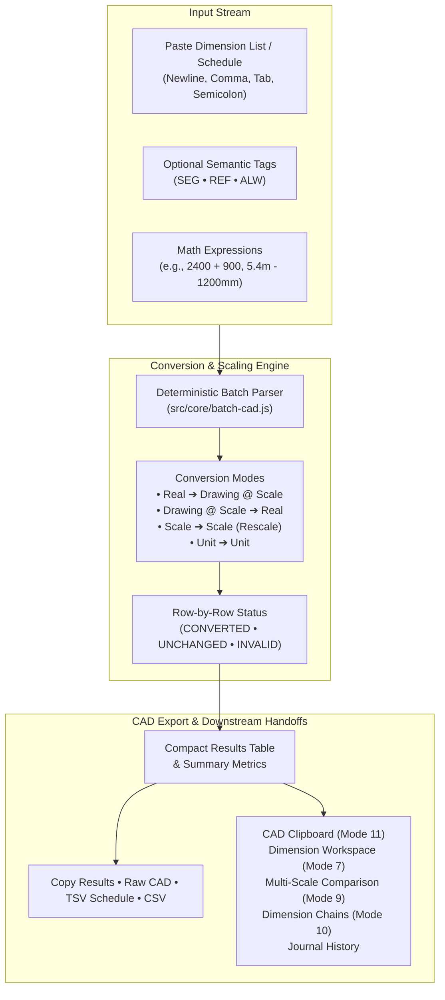
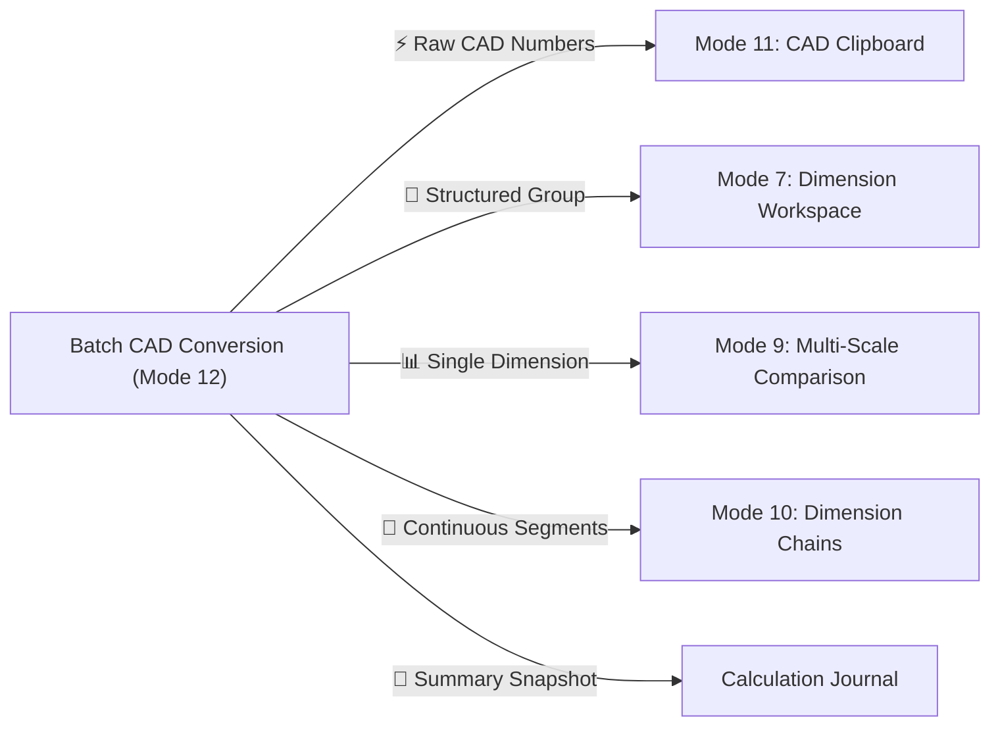

# Architecture Helping Hand — Batch CAD Conversion

> **Phase 2.5: Daily Architect Toolkit — Part 7: Batch CAD Conversion**  
> Bulk Scale & Unit Conversion Engine, Intelligent Delimiter Detection, Non-Destructive Parsing & Cross-Tool Drafting Integration

---

## 1. Overview & Purpose

Architects frequently receive or copy dimension schedules, room dimension lists, or raw measurement sequences that must all be scaled or converted simultaneously.

---

## 2. Core Principles & Architecture

> [!NOTE]
> **Batch CAD Conversion is a headless orchestration layer.**  
> It reuses existing core systems (`parser.js`, `units.js`, `dimension-expression.js`, `calculator.js`, `formatter.js`, `cad-clipboard.js`, `dimension-workspace.js`, `dimension-chains.js`) with zero duplicated mathematical formulas or parallel unit definitions.

* **Non-Destructive Parsing**: Original input strings (`originalText`) are preserved row-by-row alongside canonical SI meters (`canonicalMeters`) and target results.
* **Row-by-Row Isolation**: An invalid or malformed row never breaks or halts conversion of valid rows.
* **Inline Arithmetic Support**: Mathematical expressions like `2400 + 900` or `5.4m - 1200mm` are evaluated deterministically via the Dimension Expression Engine.
* **Semantic Dimension Types**: Supports `SEG` (Additive Segment), `REF` (Reference Dimension), and `ALW` (Clearance Allowance).
* **Strict Numerical Precision**: Standard dot `.` decimal points, customizable precision (0 to 4 decimals), and zero/negative dimension preservation (`0`, `-300`).

---

## 3. Supported Input Formats

The Batch CAD parser deterministically parses multiple formats:

| Input Style | Example Input | Parsed Name | Semantic Role | Canonical Meters |
| :--- | :--- | :--- | :---: | :---: |
| **Bare Numbers** | `2400` | `Dimension 1` | `reference` | 2.4 m |
| **Units Attached** | `3.2m` | `Dimension 2` | `reference` | 3.2 m |
| **Architectural Ft-In** | `7' 6"` | `Dimension 3` | `reference` | 2.286 m |
| **Named Rows** | `Wall North = 4800mm` | `Wall North` | `reference` | 4.8 m |
| **Tagged Named Rows** | `SEG Corridor 1: 3.2m` | `Corridor 1` | `segment` | 3.2 m |
| **Bracketed Tagged Rows** | `[ALW] Joint Gap = 25mm` | `Joint Gap` | `allowance` | 0.025 m |
| **Inline Math Expressions** | `Window 1 = 1800 + 300` | `Window 1` | `reference` | 2.1 m |
| **Mixed-Unit Expressions** | `Wall Span = 5.4m - 1200mm` | `Wall Span` | `reference` | 4.2 m |

---

## 4. Conversion Modes

1. **Real ➔ Drawing @ Scale**:
   Converts real-world physical dimensions into scale drawing millimeters/inches (e.g. `2400 mm` at `1:50` = `48.00 mm`).
2. **Drawing @ Scale ➔ Real**:
   Converts scale drawing measurements back to real-world dimensions (e.g. `48 mm` measured on a `1:50` plan = `2400.00 mm` real).
3. **Scale ➔ Scale (Rescale)**:
   Rescales dimensions from a source scale to a target scale (e.g. `48 mm` at `1:50` rescaled to `1:100` = `24.00 mm`).
4. **Unit ➔ Unit**:
   Direct unit conversion across Metric and Imperial length units (e.g. `2400 mm` ➔ `2.40 m`, `90 in` ➔ `7'-6"`).

---

## 5. Quick Presets

| Preset Key | Name | Mode | Source Unit / Scale | Target Unit / Scale |
| :--- | :--- | :--- | :--- | :--- |
| `real_to_1_50_mm` | **⚡ Real ➔ 1:50** | Real ➔ Drawing | mm | mm @ 1:50 |
| `real_to_1_100_mm` | **Real ➔ 1:100** | Real ➔ Drawing | mm | mm @ 1:100 |
| `scale_1_50_to_1_100` | **1:50 ➔ 1:100** | Scale ➔ Scale | mm @ 1:50 | mm @ 1:100 |
| `mm_to_m` | **mm ➔ m** | Unit ➔ Unit | mm | m |
| `m_to_mm` | **m ➔ mm** | Unit ➔ Unit | m | mm |
| `in_to_ft_in` | **in ➔ ft-in** | Unit ➔ Unit | in | ft-in |

---

## 6. Downstream Workflow Handoffs

* **📋 Open in CAD Clipboard (Mode 11)**: Sends formatted raw numerical sequences directly to CAD Clipboard presets.
* **📐 Add to Workspace (Mode 7)**: Generates a named Dimension Workspace group populated with converted rows and role tags.
* **📊 Multi-Scale Comparison (Mode 9)**: Loads a selected dimension into the Multi-Scale comparison matrix.
* **🔗 Create Dimension Chain (Mode 10)**: Converts valid batch rows into continuous dimension chain segments with cumulative distances.
* **📜 Save to Journal**: Commits a timestamped conversion summary snapshot with metric/imperial breakdown.

---

## 7. Performance & Verification

* **High Performance**: Benchmarked to process **1,000+ batch rows in < 10ms** via pure mathematical functions and DOM fragments.
* **Zero External Dependencies**: 100% vanilla JavaScript ES modules.
* **Comprehensive Test Suite**: Tested via `tests/batch-cad.test.js` and verified against full application test suites (`npm test`).
