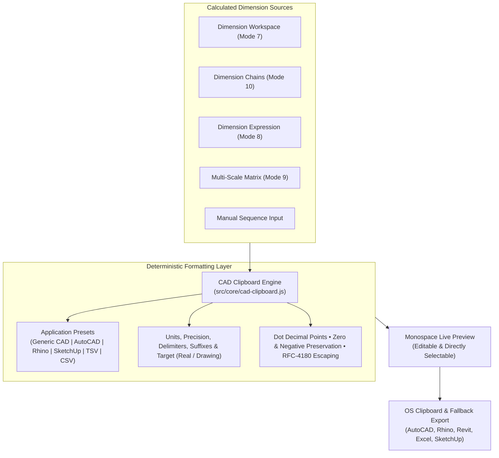

# Architecture Helping Hand — CAD Clipboard & Drafting Handoff

> **Phase 2.5: Daily Architect Toolkit — Part 6: CAD Clipboard**  
> Normalized Numerical Dimension Copy Layer, Application Presets & Drafting Handoffs for AutoCAD, Rhino, SketchUp, Revit & Spreadsheets

---

## 1. Overview & Purpose

Architects constantly calculate dimensions and need to paste clean, predictable numbers directly into CAD command lines, 3D modelers, BIM schedules, and spreadsheets without unneeded labels, emojis, or prose.

---

## 2. Core Philosophy & Integrity

> [!NOTE]
> **CAD Clipboard is strictly a formatting and handoff layer.**  
> It does **NOT** modify the underlying mathematics or state of the Dimension Workspace, Chains, Expressions, or Multi-Scale modules.

* **Clean Data First**: Default generic mode outputs pure space or newline-separated numbers without extraneous units, labels, or decorative text.
* **Standard Decimal Separator**: Enforces `.` (dot) as the decimal point to prevent syntax errors in CAD command prompts.
* **Zero & Negative Preservation**: Legitimate numerical `0` and negative dimensions (e.g. `-300 mm`) are never lost.
* **Zero Direct Plugins Required**: Formatted text is transferred via standard OS clipboard buffers or downloadable text files, ensuring 100% offline compatibility without desktop bridges.

---

## 3. Application Presets

| Preset | Target Application | Default Delimiter | Default Suffix | Typical Output Sample |
| :--- | :--- | :---: | :---: | :--- |
| **Generic CAD** | Universal CAD prompt / lines | Space | None | `2400 1800 900 1500` |
| **AutoCAD-style** | AutoCAD command line | Space / Newline | None | `2400.00 1800.00 900.00` |
| **Rhino-style** | Rhino command prompts & curves | Space | None | `2400.000 1800.000 900.000` |
| **SketchUp-style** | SketchUp Value Control Box (VCB) | Space | Symbol | `2400mm 1800mm 900mm` |
| **Spreadsheet (TSV)** | Excel, Google Sheets, LibreOffice | Tab | None | `#   Name   Real (mm)   Drawing @ 1:50` |
| **CSV Schedule** | CAD Tables & BIM schedules | Comma | None | `#,Name,"Real (mm)","Drawing @ 1:50"` |
| **Plain Text** | Specification notes & email | Newline | Symbol | `1. Wall Pier: 2400 mm\n2. Window: 1800 mm` |

---

## 4. Parameter Controls & Output Options

1. **Dimension Source**:
   - `Workspace`: Formats active schedule rows, groups, or selected items.
   - `Chain`: Formats ordered segment lengths or cumulative coordinates ($0 \rightarrow 1200 \rightarrow 3000 \dots$).
   - `Expression`: Formats math expression real or scaled drawing result.
   - `Multi-Scale`: Formats drawing dimensions across all compared scales simultaneously.
   - `Manual`: Formats ad-hoc space, comma, or plus-delimited measurement text.
2. **Value Target**:
   - `Real-World (Site)`: True physical building dimensions.
   - `Drawing @ Scale`: Scaled paper dimensions according to the active drawing scale ($1:1$ to $1:1000$).
3. **Output Unit**:
   - `mm`, `cm`, `m`, `in`, `ft`, and `ft-in` (Architectural Fractional Feet-Inches, e.g. `7'-6 1/2"`).
4. **Decimal Precision**:
   - `0`, `1`, `2`, `3`, or `4` decimal places.
5. **Unit Suffix**:
   - `None` (default for raw CAD entry), `Symbol` (`2400 mm`), `Full Name` (`2400 Millimeters (mm)`).
6. **Delimiters**:
   - `Space`, `Newline (Multi-line)`, `Comma`, `Pipe (|)`, or `Tab (TSV)`.
7. **Filter Scope**:
   - `All Active Items`, `Selected Rows Only`, `Segments Only (SEG)`, `References Only (REF)`, `Allowances Only (ALW)`.

---

## 5. Cross-Mode Handoff Integration

- **Dimension Workspace (<kbd>Mode 7</kbd>)**: Click **📋 CAD Clipboard** in the bottom toolbar to preload all active rows or selected items directly into Mode 11.
- **Dimension Expression (<kbd>Mode 8</kbd>)**: Click **CAD Clipboard** to copy the evaluated real or scaled drawing value.
- **Multi-Scale Comparison (<kbd>Mode 9</kbd>)**: Click **CAD Clipboard** to copy all drawing dimensions across multiple scales.
- **Dimension Chains (<kbd>Mode 10</kbd>)**: Click **CAD Clipboard** to format continuous segment strings or cumulative running coordinates.

---

## 6. Keyboard Shortcuts

| Key Shortcut | Action |
| :--- | :--- |
| <kbd>C</kbd> | Switch to CAD Clipboard Mode (when not typing in an input field) |
| <kbd>Ctrl+Shift+C</kbd> / <kbd>⌘⇧C</kbd> | Open CAD Clipboard from anywhere |
| <kbd>Enter ↵</kbd> | Refresh CAD Preview |
| <kbd>Ctrl+K</kbd> / <kbd>⌘K</kbd> | Open Global Command Palette ➔ search `cad` or `clipboard` |

---

## 7. Test Verification & Security

- **Test Suite**: [`tests/cad-clipboard.test.js`](file:///e:/Scaler/tests/cad-clipboard.test.js) (47 unit assertions).
- **Security Guarantee**: Zero `eval()` or `new Function()`, pure string formatting, strict RFC-4180 CSV and TSV sanitization, and full local offline execution.
