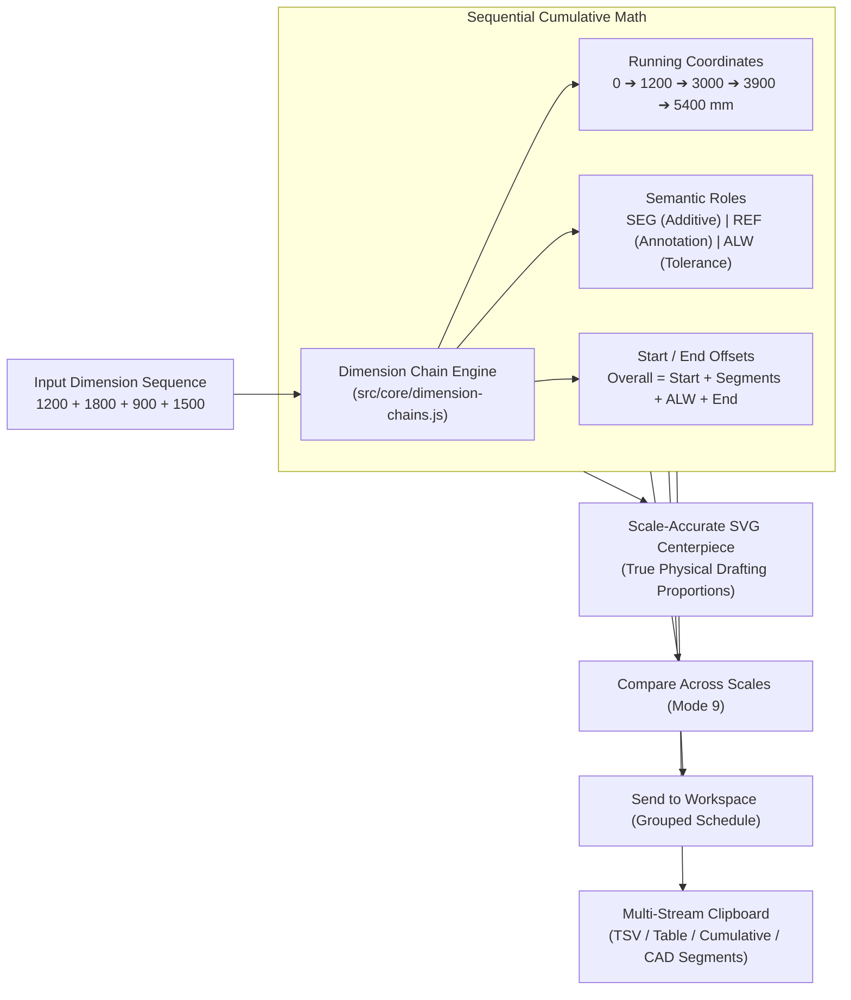

# Architecture Helping Hand — Dimension Chains

> **Phase 2.5: Daily Architect Toolkit — Part 5: Dimension Chains**  
> Ordered Continuous Dimension Strings, Cumulative Running Coordinates, Scale-Accurate SVG Drafting Visualizer & Structural Offsets

---

## 1. Overview & Purpose

In architectural drafting and construction documents, dimensions along a continuous element (such as an exterior wall with window/door openings, structural column grid lines, curtain wall mullions, or corridor partitions) are organized as **Dimension Chains** (continuous dimension strings).



---

## 2. Distinction: Dimension Chains vs. Dimension Workspace

| Feature | **Dimension Workspace (Mode 7)** | **Dimension Chains (Mode 10)** |
| :--- | :--- | :--- |
| **Model** | Unordered collection / schedule scratchpad | Strictly ordered continuous sequential string |
| **Coordinates** | Independent dimensions ($L_1, L_2, L_3$) | Running cumulative coordinates ($x_0, x_1, x_2, \dots, x_n$) |
| **Visualizer** | 2D room proportion rectangle / fixture SVG | Scale-accurate drafting dimension string with witness lines |
| **Offsets** | Flat items | Start / End datum offsets evaluated around segment totals |
| **Primary Use** | Bill of quantities, area schedules, batch scaling | Wall openings, column grids, facade rhythms, partitions |

---

## 3. Data Model & Architecture

A Dimension Chain is structured as:

```json
{
  "id": "chain_1788234_x9k2",
  "name": "North Wall Opening Sequence",
  "defaultUnit": "mm",
  "scaleRatio": 50,
  "startOffsetRaw": "300",
  "endOffsetRaw": "200",
  "segments": [
    {
      "id": "cseg_1",
      "name": "Wall Pier A",
      "rawInput": "1200",
      "dimensionType": "segment",
      "enabled": true,
      "startLabel": "Grid 1",
      "endLabel": "Window Left"
    },
    {
      "id": "cseg_2",
      "name": "Window Opening",
      "rawInput": "1500",
      "dimensionType": "segment",
      "enabled": true
    },
    {
      "id": "cseg_3",
      "name": "Door Opening [REF]",
      "rawInput": "900",
      "dimensionType": "reference",
      "enabled": true
    }
  ]
}
```

---

## 4. Semantic Segment Roles

1. **`SEG` (Segment — Additive Default)**:
   - Extends the cumulative chain baseline: $\text{End} = \text{Start} + \text{Length}$.
   - Included in `segmentTotalMeters`.
2. **`REF` (Reference — Annotation Pin)**:
   - Anchored at the current running coordinate without extending the structural baseline: $\text{End} = \text{Start}$.
   - Excluded from `segmentTotalMeters`.
3. **`ALW` (Allowance — Tolerance / Expansion Joint)**:
   - Extends the chain baseline and contributes to `allowanceTotalMeters`.

---

## 5. Mathematical Formulations & Offsets

$$\text{Position}_0 = \text{StartOffset}$$

$$\text{Position}_i = \text{Position}_{i-1} + \text{Length}_i \quad (\text{for active SEG or ALW})$$

$$\text{Overall Extent} = \text{StartOffset} + \sum \text{SEG} + \sum \text{ALW} + \text{EndOffset}$$

$$\text{Drawing Length} = \frac{\text{Real Meters}}{\text{Scale Ratio}}$$

---

## 6. Scale-Accurate SVG Drafting Visualizer

The SVG visualizer (`#chains-svg-viewport-wrapper`) renders true architectural drafting graphics:
- **Baseline Axis**: Continuous horizontal engineering line with major ticks at every cumulative position.
- **Coordinate Markers**: Monospace running distance numbers ($0, 1200, 3000, 3900, 5400\text{ mm}$).
- **Witness Lines & Architectural Slashes**: $45^\circ$ architectural slash ticks on extension lines.
- **Physical Proportions**: If Segment A is $1800\text{ mm}$ and Segment B is $1200\text{ mm}$, Segment A visually occupies exactly $1.5\times$ the width of Segment B.
- **Interactive Selection**: Selecting any segment highlights its physical slice with a glowing bounding box in both the SVG and schedule table.

---

## 7. Quick Add Input Syntax

| Input String | Result |
| :--- | :--- |
| `1200 + 1800 + 900 + 1500` | Creates 4 sequential additive segments (`1200`, `1800`, `900`, `1500`) |
| `1200 1800 900 1500` | Creates 4 sequential segments |
| `Wall A 1200, Window 1500, Door 900 ref` | Creates 3 named segments with custom types |
| `1200 + 300` | Mathematical expression evaluated into a $1500\text{ mm}$ segment |

---

## 8. Built-in Architectural Templates

- **Wall Openings**: Pier A ($1200\text{ mm}$), Window ($1500\text{ mm}$), Center Pier ($600\text{ mm}$), Door ($900\text{ mm}$), Pier B ($1200\text{ mm}$).
- **Grid Bays**: Structural column grid lines (Bay 1–2 $6000\text{ mm}$, Bay 2–3 $6000\text{ mm}$, Bay 3–4 $7500\text{ mm}$, Bay 4–5 $6000\text{ mm}$).
- **Facade Rhythm**: Curtain wall mullion and glass panel distribution ($150\text{ mm} \rightarrow 1350\text{ mm} \rightarrow 150\text{ mm} \rightarrow 1350\text{ mm} \rightarrow 150\text{ mm}$).
- **Corridor Partitions**: Interior room partition sequence ($2400\text{ mm} \rightarrow 1800\text{ mm} \rightarrow 5400\text{ mm}$).

---

## 9. Interoperability & Clipboard Formats

1. **Compare Across Scales (Mode 9)**: Directly transfers the chain's overall extent or selected segment into the Multi-Scale Comparison matrix.
2. **Send to Dimension Workspace (Mode 7)**: Automatically generates a named group containing all chain segments in order.
3. **Save to Calculation Journal (<kbd>H</kbd>)**: Persists a full restoreable snapshot into the calculation journal.
4. **Command Palette (<kbd>Ctrl+K</kbd>)**: Typing `chain 1200 1800 900` displays an instant live dimension chain preview with a 1-click open shortcut.
5. **Multi-Stream Exports**:
   - **TSV**: Tab-separated table ready for CAD and Excel import.
   - **Markdown Table**: Formatted documentation table.
   - **Cumulative Coordinates**: Running positions stream (`0   1200   3000   3900   5400`).
   - **Segment Measurements**: Raw length sequence (`1200   1800   900   1500`).
   - **Drawing Dimensions**: Scaled paper lengths (`24 mm   36 mm   18 mm   30 mm`).

---

## 10. Verification & Test Suite

- **`tests/dimension-chains.test.js`**: 67 automated assertions verifying basic math, cumulative positions, disabled segment skipping, offsets, semantic types, scale math, SVG generation, workspace conversion, and templates.
- **`tests/ui-contracts.test.js`**: 294 DOM contract assertions ensuring complete UI wiring.
- **`npm test`**: Verified clean 100% pass rate across all 12 test suites.
