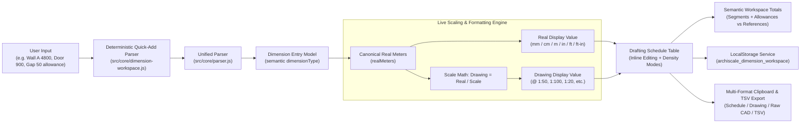

# Architecture Helping Hand — Dimension Workspace

> **Phase 2.5: Daily Architect Toolkit — Part 2.5: Dimension Workspace v1.1**  
> High-Precision Multi-Dimension Scratchpad, Batch Scaling Engine, Semantic Drafting Schedule & CAD Preparation

---

## 1. Overview

The **Dimension Workspace** is a dedicated architectural scratchpad designed for rapid dimension entry, simultaneous scale conversion, batch measurement management, cumulative site/drawing totals calculation, and direct CAD clipboard preparation (Rhino, AutoCAD, SketchUp).

Architects, draftspersons, and estimators frequently work with multiple site dimensions simultaneously. The Dimension Workspace provides an architectural schedule with:
- **Semantic Roles**: Distinguishes between additive structural segments, planning allowances, and non-additive reference dimensions.
- **Natural Quick Add**: Deterministic parsing of single-line strings like `Wall A 4800` or `Door 900`.
- **Direct Inline Editing**: Instant correction of names, measurements, and notes without recreating rows.
- **Keyboard-First Workflow**: Rapid entry and navigation (<kbd>N</kbd>, <kbd>D</kbd>, <kbd>Del</kbd>, <kbd>↑</kbd>/<kbd>↓</kbd>, <kbd>Ctrl+C</kbd>, <kbd>Ctrl+Enter</kbd>).
- **Grouping Foundation**: Organize dimensions into named groups with automatic group subtotals and collapse states.
- **CAD Clipboard Output**: Formatted schedules, drawing measurements, and raw number streams for direct CAD drafting.

---

## 2. Architecture & Design Principles



---

## 3. Data Model & Schema (v1.1)

Each dimension row in the workspace is stored as a normalized `DimensionEntry` object:

```typescript
type DimensionType = 'segment' | 'allowance' | 'reference';

interface DimensionEntry {
  id: string;                 // Unique ID (e.g. "dim_1730000000000_1_a1b2c")
  name: string;               // Architectural member name (e.g. "Wall A", "Door Opening")
  rawInput: string;           // User input string (e.g. "2.4m", "900", "7' 10\"", "3 1/2\"")
  dimensionType: DimensionType; // 'reference' (default), 'segment' (additive), 'allowance' (tolerance)
  defaultUnit: string;        // Fallback unit if no suffix was provided ("mm", "cm", "m", "in", "ft")
  parsedUnit: string;         // Recognized unit key
  parsedNumericValue: number; // Raw parsed number
  realMeters: number|null;    // Canonical real-world dimension in meters
  isValid: boolean;           // True if input successfully resolved to a positive number
  errorMessage: string|null;  // Contextual error text if invalid
  notes: string;              // Optional user notes (e.g. "Verify on site", "North")
  enabled: boolean;           // Toggle inclusion in totals calculation
  groupId: string|null;       // Group container ID (e.g. "grp_1730000000000_a1b2")
}

interface DimensionGroup {
  id: string;                 // Unique group ID
  name: string;               // Group label (e.g. "Wall North", "Bay Grid 1-4")
  collapsed: boolean;         // Group collapse state
}

interface WorkspaceState {
  version: string;            // Schema version (e.g. '2.5.1')
  scaleRatio: number;         // Active drawing scale denominator (e.g. 50 for 1:50)
  displayUnit: string;        // Target unit for formatting ("mm", "cm", "m", "in", "ft", "ft_in")
  density: 'comfortable'|'compact'; // Workspace row density
  groups: DimensionGroup[];   // Group containers
  entries: DimensionEntry[];  // Dimension items
}
```

---

## 4. Semantic Roles & Totals Calculation

### 4.1 Dimension Roles
- **Segment (`SEG`)**: Additive dimensions that participate in cumulative run/site totals (e.g. wall segments, structural bays, facade divisions).
- **Allowance (`ALW`)**: Planning tolerances and construction gaps added into cumulative totals (e.g. expansion joints, finish allowances).
- **Reference (`REF`, Default)**: Object or condition dimensions describing openings or fixtures, explicitly **excluded from cumulative totals** (e.g. door width, window opening, furniture footprint).

### 4.2 Mathematical Formulas
For active valid rows:
$$\text{Total Segments (Meters)} = \sum_{i \in \text{Enabled Segments}} \text{realMeters}_i$$
$$\text{Total Allowances (Meters)} = \sum_{i \in \text{Enabled Allowances}} \text{realMeters}_i$$
$$\text{Combined Total (Meters)} = \text{Total Segments} + \text{Total Allowances}$$
$$\text{Total Drawing} = \frac{\text{Combined Total}}{S}$$
$$\text{References Total (Informational)} = \sum_{i \in \text{Enabled References}} \text{realMeters}_i$$

---

## 5. Natural Quick-Add Syntax

The deterministic `parseQuickAddString` extractor supports single-line entries without manual field switching:

| Input Example | Extracted Name | Extracted Input | Semantic Type |
| :--- | :--- | :--- | :--- |
| `Wall A 4800` | `Wall A` | `4800` | `reference` (or active default) |
| `Door Opening 900mm` | `Door Opening` | `900mm` | `reference` |
| `seg Bay 1 6m` | `Bay 1` | `6m` | `segment` |
| `[segment] Partition 3200` | `Partition` | `3200` | `segment` |
| `Expansion Joint 50 allowance` | `Expansion Joint` | `50` | `allowance` |
| `Beam 12'-6 1/2"` | `Beam` | `12'-6 1/2"` | `reference` |
| `2400` | `Dimension` | `2400` | active default |

---

## 6. Keyboard Shortcuts & Workflow

| Shortcut | Context | Action |
| :--- | :--- | :--- |
| <kbd>7</kbd> | Global | Switch to **Dimension Workspace** mode |
| <kbd>N</kbd> | Workspace | Focus Quick-Add measurement input for rapid sequential entry |
| <kbd>Enter</kbd> | Input / Form | Add row / Commit inline edit |
| <kbd>Ctrl</kbd>+<kbd>Enter</kbd> | Form | Submit quick add dimension |
| <kbd>Esc</kbd> | Workspace | Cancel inline edit / Clear row selection |
| <kbd>↑</kbd> / <kbd>↓</kbd> | Table | Navigate and select dimension rows |
| <kbd>D</kbd> | Table | Duplicate selected dimension row |
| <kbd>Delete</kbd> / <kbd>Backspace</kbd> | Table | Delete selected dimension row(s) |
| <kbd>Ctrl</kbd>+<kbd>C</kbd> / <kbd>⌘</kbd>+<kbd>C</kbd> | Table | Copy selected dimension value to clipboard |

---

## 7. Multi-Format Clipboard & CAD Preparation

- **Copy Selected**: Copies selected row(s) as formatted dimension text.
- **Copy Segments**: Filters schedule to copy additive structural segments only.
- **Copy References**: Filters schedule to copy non-additive reference dimensions only.
- **Copy All**: Copies complete structured architectural schedule.
- **Copy Raw (CAD)**: Copies clean newline-delimited numbers (`4800\n3200\n900`) for direct pasting into Rhino command line, AutoCAD coordinate inputs, or SketchUp tape measure.
- **Export TSV**: Exports complete tab-delimited schedule with types, groups, notes, and statuses for Excel / Google Sheets.

---

## 8. Verification & Test Coverage

All functionality is verified by automated unit tests in `tests/dimension-workspace.test.js` (103 assertions):
- Semantic dimension types and default validation
- Deterministic natural quick-add string parsing
- Multi-metric segment, allowance, combined, and reference totals
- Group creation, grouping subtotals, and collapse state persistence
- Multi-format clipboard generation (Selected, Segments, References, Raw CAD, TSV)
- Backwards compatibility with legacy v2.5.0 storage schemas
- Strict unit validation and error recovery
